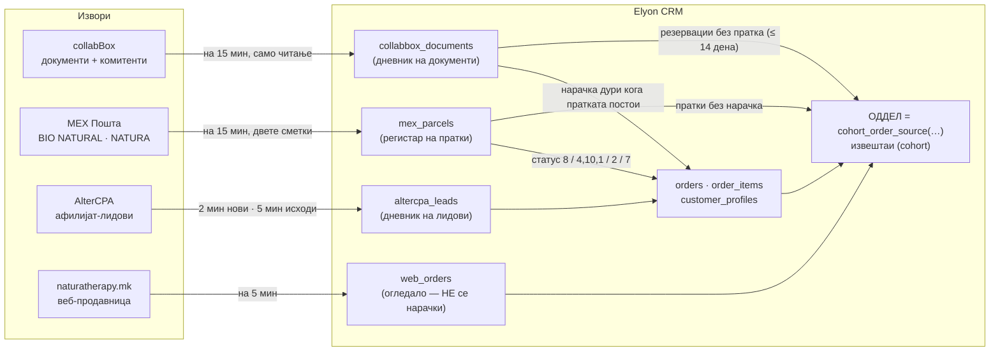

# collabBox: водич за интеграција

**Natura Therapy MK · Elyon CRM (македонска инстанца)**

| | |
|---|---|
| **Последна проверка** | **01.10.2026 околу 09:20 (Скопје).** Сите бројки се мерени тогаш, само со читање (SELECT), од живата база и од суровите извози. |
| **За кого е** | За идниот интегратор (на пр. партнер за Salesforce) и за сопственикот. Документот треба да се разбере и без нашиот код. |
| **Што е правило** | Правилата живеат во SQL-функциите во базата (листата е во §11). Овој документ ги опишува, но не ги заменува. Ако документот и функцијата се разминат, важи функцијата. |
| **Лични податоци** | Нема ги. Нема имиња на клиенти, телефони ни адреси. Примерите се анонимизирани (`07X XXX XXX`, `#NNNNNN`). |
| **Тајни** | Нема ги. Нема лозинки, токени, клучеви ни адреса на серверот. Пристапите се чуваат во тајниот трезор на сопственикот (VAULT §6, §7, §8). |
| **Ознака „непотврдено“** | Се става на секое тврдење што не можев да го докажам со код или со податоци. |

---

## Содржина

0. [Најважното на една страница](#0-најважното-на-една-страница)
1. [Преглед на системите](#1-преглед-на-системите)
2. [Папки и типови документи во collabBox](#2-папки-и-типови-документи-во-collabbox)
3. [Шесте оддели](#3-шесте-оддели)
4. [DocNumber е бројот на пратката кај MEX](#4-docnumber-е-бројот-на-пратката-кај-mex)
5. [Полиња и мапирање во CRM](#5-полиња-и-мапирање-во-crm)
6. [Идентитет на клиентот](#6-идентитет-на-клиентот)
7. [Кој е продавачот](#7-кој-е-продавачот)
8. [Синхронизација](#8-синхронизација)
9. [За интеграторот (Salesforce и сл.)](#9-за-интеграторот-salesforce-и-сл)
10. [Речник](#10-речник)
11. [Последна проверка и каде живеат дефинициите](#11-последна-проверка-и-каде-живеат-дефинициите)
- [Прилог А: клучни бројки](#прилог-а-клучни-бројки)

---

## 0. Најважното на една страница

1. **collabBox** е ERP-то на Accent Computers. Во него телешоп, социјалните мрежи и афилијат-продавачите **книжат документ „Нарачка …“**, а магацинот по него ја пакува и праќа пратката. collabBox нема API. CRM-от го чита на секои 15 минути, **само со читање**.
2. **Бројот на документот (DocNumber) е истовремено бројот на пратката кај MEX**, на пример `002-9102-NNNNNN/2026`. Тој број ги поврзува collabBox, MEX и CRM-от.
3. **Одделот го одредува ТИПОТ на документот (папката).** Серијата во бројот (`9102`, `9100` …) **греши кај околу 1.100 документи**. Ако типот е познат, никогаш не одлучувај по серијата.
4. **collabBox докажува дека пратката е испратена, а не дека е платена.** Дали е наплатено или вратено одлучува **само MEX** (статус 2 = наплатено, 7 = вратено).
5. Има **шест оддели**: Affiliate – Lead in · Affiliate – Lead out · Телешоп – Lead out · Телешоп – Lead in · Социјални мрежи · Веб-продавница. Секоја продажба е во **точно еден**: се брои еднаш и никогаш не се копира.
6. Продажба направена во самиот CRM оди по **MEX-профилот на својата пратка**. BIO NATURAL значи Affiliate. NATURA значи Телешоп, социјални мрежи или веб.
7. Од документ во collabBox, CRM-от создава нарачка **дури откако пратката ќе се појави кај MEX**. Дотогаш документот е **„резервација“**: се брои во својот оддел како „Во магацин за пакување“, но не е нарачка.
8. Типот **10111 „Нарачка LEADS“ никогаш не станува нова нарачка.** Тоа е испраќањето на лид што веќе постои во AlterCPA. Документот само го запишува неговиот автор како продавач.
9. **Клиентот е неговиот телефон**: се споредуваат последните 8 цифри, а се чува како `+389XXXXXXXX`. Шифрата на комитентот во collabBox **не** е идентитет.
10. Тимот на продавачот (бизнис-линијата) **никогаш** не го одредува одделот.

---

## 1. Преглед на системите

### 1.1 Улогите

| Систем | Што е | За што е извор на вистина | Како CRM-от го чита | Клуч (идемпотентност) |
|---|---|---|---|---|
| **collabBox** (Accent Computers) | ERP за телешоп, магацин и канцеларија: документи за испраќање („Нарачка …“) и регистар на комитенти | дека продажбата е **книжена и испратена**; **папката (типот)**, од која следи одделот; **авторот**, кој е продавачот; **ставките** (производите); комитентот | Edge-функцијата `collabbox-sync`. Таа го емулира HTML-формуларот преку HTTP, со листа од само 6 дозволени барања за читање. Работи на 15 мин од 07:00 до 22:59 и ноќно во 00:00. | `DocNumber` |
| **MEX Пошта** | курирот, со **две сметки**: BIO NATURAL и NATURA | **испратено, наплатено или вратено**; откупот (COD) во денари | Edge-функцијата `mex-reconcile` преку JSON API (5 endpoints, заглавие `AuthKey`). Работи на 15 мин од 06:00 до 22:59 за двете сметки, плус неделна проверка од 60 дена. | `tracking_id` (= DocNumber) |
| **AlterCPA** | платформа за афилијат-лидови | дали лидот е **потврден или мртов** (phase 3 / 4 / 5) | Edge-функцијата `altercpa-sync`: нови лидови на 2 мин, исходи на 5 мин од 07:00 до 20:55 | AlterCPA `id` (`oid`) |
| **naturatherapy.mk** | веб-продавницата, засебна платформа; **не смее да се менува** | веб-нарачката и нејзиниот исход | Edge-функцијата `web-sync`, со улога само за читање, на 5 мин, плус ноќен целосен преглед | `order_number` (`NTMK…` или `OC-…`) |
| **Elyon CRM** | центарот (hub): нарачки, клиенти, продавачи, оддели, извештаи | **одделот**, кредитот на продавачот, извештаите (cohort) | — | `orders.id` (uuid), `display_id` (`ORD-NNNNN`) |

### 1.2 Тек на податоците



### 1.3 Патот на една продажба, по оддел

| Оддел | Како настанува продажбата | Каде се книжи | Која MEX-сметка | Што станува во CRM |
|---|---|---|---|---|
| **Телешоп – Lead in** | клиентот сам се јавува (ТВ-реклама) | collabBox **10036** „Нарачка in“ | NATURA, серија 9100 | Документот чека пратка, па станува нарачка. Статусот го носи MEX. |
| **Телешоп – Lead out** | агентот му се јавува на постоечки клиент | collabBox **10050** „Нарачка out“ | NATURA, серија 9102 | исто |
| **Социјални мрежи** | нарачка од социјалните мрежи | collabBox **10106** (и 10055 за продавница) | NATURA, серија 9108 (10055: серија 1300, не оди преку MEX) | 10106 оди исто како погоре; 10055 само се запишува |
| **Affiliate – Lead in** | лид од афилијат-мрежата во AlterCPA, потврден од нивен оператор | AlterCPA; испраќањето се книжи во collabBox **10111** | BIO NATURAL, 9110 (пред 02.04.2026 NATURA) | Нарачката доаѓа од AlterCPA. 10111 само го запишува авторот како продавач на таа нарачка. |
| **Affiliate – Lead out** | агент во CRM-от му продава на постоечки афилијат-клиент (предикциска листа) | **CRM**; испраќањето се книжи во collabBox **10114** „LEADS-OUT“ | BIO NATURAL, 9103 | Нарачката е од CRM-от. 10114 само кредитира. Ако не постои CRM-нарачка, 10114 сам станува нарачка. |
| **Веб-продавница** | купување на naturatherapy.mk | веб-продавницата сама ја праќа пратката | NATURA, `NTMK…` или `M…` | Се огледа во `web_orders`. **Никогаш не станува нарачка во CRM.** |

**Кој ја создава MEX-пратката.** Денес пратката ја создава **магацинот преку collabBox**, а за веб ја создава веб-продавницата. CRM-от пратки не создава:

- Копчето „Испрати до MEX“ е изградено на 01.10.2026, но е **исклучено**. Поставката `app_settings.mex_push` е `enabled: false`, и двете сметки се `false`, и во дневникот нема ниту еден обид.
- Постои и CSV-извоз од CRM-от за порталот на MEX.
- Во регистарот има 59 BIO NATURAL пратки чиј број е бројот на CRM-нарачката (`ORD-NNNNN`). Како точно се создадени е **непотврдено**: рачно во порталот или преку CSV.

---

## 2. Папки и типови документи во collabBox

„Папка“ и „тип на документ“ се исто нешто. Типот има број (ID) и име. **Типот ја одредува улогата на документот во CRM-от и неговиот оддел.**

### 2.1 Главната табела

Значење на колоните:

- **Улога** е вредноста од `collabbox_doc_role(тип)` (објаснета во §2.2).
- **Дневник** е бројот документи во `collabbox_documents` од 01.03.2026 до 01.10.2026.
- **Историја** е бројот документи во целосната жетва на заглавија од 10.09.2026 (01.01.2023 до 11.09.2026).

| Тип | Име во collabBox | Улога | Оддел | MEX-профил | Очекувана серија | Дневник | Историја | Години |
|---|---|---|---|---|---|---:|---:|---|
| **10111** | Нарачка LEADS | `credit` | Affiliate – Lead in | BIO NATURAL (од 02.04.2026; пред тоа NATURA) | 9110 | 21.583 | 45.188 | 2024 (100) · 2025 · 2026 |
| **10114** | LEADS-OUT Нарачка | `order_unless_held` | Affiliate – Lead out | BIO NATURAL (97% од 02.04.2026) | 9103 | 2.194 | 4.035 | 2025 – 2026 |
| **10050** | Нарачка out | `order` | Телешоп – Lead out | NATURA | 9102 | 22.919 | 168.594 | 2023 – 2026 |
| **10036** | Нарачка in | `order` | Телешоп – Lead in | NATURA | 9100 | 18.016 | 87.921 | 2023 – 2026 |
| **10106** | Нарачка Социјални Мрежи | `order` | Социјални мрежи | NATURA | 9108 (постари: `НСЦ`) | 2.769 | 19.274 | 2023 – 2026 |
| **10055** | Нарачка С. Мрежи-Продавница | `record` | (Социјални мрежи, само евиденција) | не оди преку MEX | 1300 | 85 | 1.013 | 2023 – 2026 |
| 10107 | Нарачка Продавници | `record` | — (сопствени продавници) | не оди преку MEX | `ННП` (917 од 933) | 933 | (не е во жетвата) | 2026 |
| 10112 | Нарачка WEB | `record` | — (веб се чита директно од продавницата) | — | `WEB` | 1 | 630 | 2024 – 2026, вредност 0 |
| 10099 | Нарачка Продавница Ист Гејт | `record` | — | — | непознато | 0 | — | — |
| 10063 | Нарачка in/out | `record` | — | — | 9225 | 0 | 12 | 2023, 2025 |
| 10058 | Нарачка in Final | `record` | — | — | — | 0 | 0 | — |
| 10037 и други типови за продавници и снабдување | (на пр. налози за поединечни продавници) | не се читаат | не се продажба | — | — | — | — | **непотврдено**: ID-ата не се запишани во кодот |

Забелешки:

- Синхронизацијата ги чита секој ден само овие 11 типа: 10036 · 10050 · 10106 · 10114 · 10111 · 10055 · 10107 · 10112 · 10099 · 10063 · 10058 (`NIGHTLY_TYPES`).
- Типовите за налози за снабдување на продавниците не се читаат. Тие **не се малопродажба** и не смеат да влезат во приходот. Пример: во пробното читање за 25–27.09.2026 имаше 13 такви типа со по еден документ, вкупно 2.495.760 ден.
- **Ниту еден телешоп-документ не е испратен преку BIO NATURAL.** Нарачките од типовите 10036, 10050 и 10106 што имаат пратка се 100% на NATURA (38.017 нарачки).
- Документите 10114 на NATURA се 102. Повеќето се од времето пред BIO NATURAL да постои (02.04.2026).
- Во дневникот, кај типовите `record` полето `department` се пополнува по серија и е **само информативно**. Тие документи никогаш не стануваат нарачки.

### 2.2 Што прави секоја улога (`collabbox_doc_role`)

| Улога | Типови | Што прави CRM-от |
|---|---|---|
| `order` | 10036 · 10050 · 10106 | **Создава нарачка, но само кога MEX-пратката веќе постои.** Ако нарачка (или веб-нарачка) веќе ја држи пратката, тоа е `conflict` и втора нарачка не се создава. |
| `order_unless_held` | 10114 | Создава нарачка **само ако ниту една нарачка не ја држи или не ја именува пратката**. Ако ја држи, на таа нарачка го запишува авторот на документот како продавач. И овој тип чека пратка. |
| `credit` | 10111 | **Никогаш не создава нарачка**, бидејќи продажбата доаѓа од AlterCPA. Го запишува авторот како продавач на нарачката што ја држи пратката. |
| `record` | сите други | Документот се запишува само во дневникот. |

### 2.3 Серијата греши: типот е посилен од серијата

Серијата е вториот дел од DocNumber (`002-**9102**-…`). Обично ѝ одговара на папката, но не секогаш:

| Тип | Документи со „туѓа“ серија (цела историја, жетва 10.09) | Во дневникот од 01.03.2026 |
|---|---|---:|
| 10114 LEADS-OUT | 778 со 9102 · 5 со 9110 · 2 со 9100 | 40 со 9102 · 2 со 9110 |
| 10050 Нарачка out | 288 со 9100 · 220 со 9103 · 9 со 9110 · 5 со 9108 · 10 други | 71 со 9100 · 16 со 9103 |
| 10036 Нарачка in | 108 со 9102 · 10 со 9103 · 1 друга | 26 со 9102 · 9 со 9103 |
| 10111 LEADS | 22 со 9100 · 10 со 9103 · 3 други | 6 со 9100 · 5 со 9103 |

Мерењето на 28.09 ги наброи трите главни групи: 703 LEADS-OUT со 9102, 286 „Нарачка out“ со 9100 и 99 „Нарачка in“ со 9102, околу **1.100**. Сите заедно во жетвата се околу 1.500. Од 01.03.2026 ги има 175 од 68.500 (0,26%).

**Правило:** ако типот е познат, **секогаш одлучува типот**. Серијата се користи само ако типот е непознат:

- кај пратка кај MEX што нема документ;
- кај стара нарачка без запишан тип.

### 2.4 Облик на бројот на документот (DocNumber)

`002-SSSS-N/ГГГГ`, на пример `002-9102-NNNNNN/2026`.

- `002` е фиксен префикс на сите документи. Најверојатно е деловната единица 2, но тоа е **непотврдено**.
- `SSSS` е серијата: 9100, 9102, 9103, 9108, 9110, 1300. Продавниците користат `ННП`, веб користи `WEB`, а постарите социјални документи `НСЦ`.
- `N` е реден број, од 2 до 6 цифри. Дали се ресетира секоја година е **непотврдено**.
- `ГГГГ` е годината.
- Синхронизацијата бара документите од типовите `order` да одговараат на `^[0-9]{3}-[0-9]{4}-[0-9]+/[0-9]{4}$`. Ако не одговараат, документот се прескокнува со причина `bad_doc_number`.

---

## 3. Шесте оддели

Ова е законот на сопственикот од 28–29.09.2026 и важи за **целата историја**:

> „Не гледаме во кој систем е направена нарачката, гледаме по оддели: affiliate lead in / affiliate lead out / teleshop lead in / teleshop lead out / social / web.“

> „Секоја нарачка испратена преку BIO NATURAL е affiliate IN и OUT. Ниту една телешоп-нарачка не е испратена преку BIO NATURAL; телешоп испраќа преку NATURA. Веб е целосно преку NATURA.“

### 3.1 Шесте, по редоследот на прикажување

| # | Клуч (`cohort source`) | Име во UI | Што содржи | Запишано како `sale_source / sale_source_detail` | MEX-профил · серија |
|---|---|---|---|---|---|
| 1 | `altercpa` | **Affiliate – Lead in** | AlterCPA-лидови што се примени како нерешени (pending) и потоа се решени, плус collabBox 10111 | `altercpa/bridge` · `altercpa/history` · `altercpa/collabbox_leads` · `affiliate/partner` | BIO NATURAL, 9110 |
| 2 | `elyon_crm` | **Affiliate – Lead out** | Повторна продажба на афилијат-клиенти: CRM-продажба на BIO NATURAL или уште без пратка, плус collabBox 10114 | `elyon_crm/prediction_list` · `elyon_crm/direct` · `elyon_crm/collabbox_leads_out` (`elyon_crm/disposition` е исход на повик, не продажба) | BIO NATURAL, 9103 (CRM-продажба: која било BIO NATURAL серија) |
| 3 | `teleshop_out` | **Телешоп – Lead out** | collabBox 10050, вклучително и клиенти што првично дошле од афилијат (одлучува папката), плус CRM-продажба на NATURA надвор од 9100, 9108 и 1300 | `collabbox/teleshop_out` | NATURA, 9102 |
| 4 | `teleshop_other` | **Телешоп – Lead in** | collabBox 10036 (ТВ-лидовите), плус сè што правилото не може да го смести | `collabbox/teleshop` (и стари `legacy/*`, NULL) | NATURA, 9100 |
| 5 | `social` | **Социјални мрежи** | collabBox 10106 и 10055 | `collabbox/social` · `collabbox/1300` | NATURA, 9108 / 1300 |
| 6 | `web` | **Веб-продавница** | naturatherapy.mk: огледалото `web_orders`, **не се нарачки** | (во `orders` има 0 веб-редови) | NATURA, `NTMK…` / `M…` |

Клучевите не се менуваат никогаш. `elyon_crm` значи „Affiliate – Lead out“, а `teleshop_other` значи „Телешоп – Lead in“. Тоа се историски имиња.

### 3.2 Постапка: „Во кој оддел оди овој запис?“

```
ВЛЕЗ: еден запис

1. Веб-нарачка (web_orders)                      → web   (никогаш не е во orders)
2. MEX-пратка без нарачка и без веб-барање       → cohort_parcel_source(cohort_parcel_split(сметка, серија, tracking, sender_ref))   [§3.6]
3. collabBox-резервација (документ без пратка,   → одделот на папката: collabbox_department(тип, DocNumber)   [§3.3]
   до 14 дена стар, без нарачка)
4. Нарачка во orders:
     оддел = cohort_order_source(sale_source, sale_source_detail, mex_tracking_id, dept_override)
           = coalesce(dept_override, mapping)                                        [§3.4, §3.5]
   каде што sale_source / sale_source_detail се запишуваат ЕДНАШ при внес:
     - документ од collabBox → collabbox_department(тип, DocNumber)                   [§3.3]
     - AlterCPA              → altercpa / bridge (жив мост) или history (увоз)
     - рачно во CRM          → elyon_crm / prediction_list | direct | disposition
   а dept_override го пополнува тригер, само за CRM-продажба, според MEX-профилот на пратката.
```

### 3.3 Документ од collabBox: по ТИП, а ако типот е непознат, по СЕРИЈА (`collabbox_department`)

| Тип | → `{sale_source, detail}` | Оддел |
|---|---|---|
| 10111 | `altercpa / collabbox_leads` | Affiliate – Lead in |
| 10114 | `elyon_crm / collabbox_leads_out` | Affiliate – Lead out |
| 10050 | `collabbox / teleshop_out` | Телешоп – Lead out |
| 10036 | `collabbox / teleshop` | Телешоп – Lead in |
| 10106, 10055 | `collabbox / social` | Социјални мрежи |
| непознат тип или тип за евиденција, по серија | 9110 → Lead in · 9103 → Affiliate Lead out · 9102 → Т-out · 9100 → Т-in · 9108/1300 → Social · друго → NULL | — |

Аргументите `p_person` и `p_at` постојат во функцијата, но **не се користат**. Ниту продавачот ниту датумот не го менуваат одделот.

### 3.4 Продажба направена во CRM: оди по MEX-ПРОФИЛОТ (`order_dept_override`)

Ова важи само за `sale_source = elyon_crm` со `detail` `prediction_list` или `direct`:

| Пратката на нарачката | → `orders.dept_override` |
|---|---|
| `mex_account = bio_natural` | `elyon_crm` (Affiliate – Lead out), **без оглед на серијата** |
| `natura`, број `___-9100-…` | `teleshop_other` (Телешоп – Lead in) |
| `natura`, `___-9108-…` или `___-1300-…` | `social` |
| `natura`, сè друго (9102, 9103, `ORD-…`) | `teleshop_out` (Телешоп – Lead out) |
| уште нема пратка | NULL, па важи табелата од §3.5. Тоа значи Affiliate – Lead out сè додека MEX не го покаже профилот. |

- Полето го пополнува тригерот `tg_orders_zz_dept_override`. **Никогаш не се пишува рачно.**
- Одделот се преодлучува во моментот кога `mex-reconcile` ќе ја поврзе пратката.
- Состојба на 01.10: 726 нарачки имаат override. Од нив 723 се на BIO NATURAL (листа) и 3 на BIO NATURAL (директно), сите `elyon_crm`. Уште 16 се на NATURA (листа) и се `teleshop_out`.

### 3.5 Нарачка без override: правилата на `cohort_order_source(sale_source, detail, tracking)`

Се применува првото правило што одговара:

| Правило | → оддел |
|---|---|
| CRM-продажба (`elyon_crm` + `prediction_list`/`direct`) чија пратка е `___-9102-…` | `teleshop_out` |
| … `___-9100-…` | `teleshop_other` |
| … `___-9108-…` или `___-1300-…` | `social` |
| `collabbox/teleshop_out` (и старите `elyon_crm/collabbox_out`, `altercpa/team_collabbox_out`) | `teleshop_out` |
| `altercpa`/`affiliate` + `team_prediction`/`team_collabbox_leads_out` (повлечено правило, 0 редови) | `elyon_crm` |
| секое друго `altercpa` / `affiliate` | `altercpa` |
| секое друго `elyon_crm` (вклучително `collabbox_leads_out`, `disposition`) | `elyon_crm` |
| `web` | `web` |
| `collabbox` + `social` / `1300` | `social` |
| сè друго (`collabbox/teleshop`, `legacy/*`, NULL) | `teleshop_other` |

**Извештаите ја користат секогаш формата со 4 аргументи**, која го става `dept_override` напред. Формите со 2 и 3 аргументи тивко го губат правилото за MEX-профилот, па не ги користи за извештаи.

### 3.6 MEX-пратка без нарачка: прво по ПРОФИЛ, па по СЕРИЈА (`cohort_parcel_split` → `cohort_parcel_source`)

| Пратка | split | Оддел |
|---|---|---|
| BIO NATURAL, серија 9110 | `mex_leads` | Affiliate – Lead in |
| BIO NATURAL, која било друга серија или облик | `mex_leads_out` | Affiliate – Lead out |
| број или `sender_reference` што почнува со `NTMK`, број `M<цифри>`, или пратка што ја бара жива веб-нарачка | `mex_web` | Веб-продавница |
| (NATURA) 9110 | `mex_leads` | Affiliate – Lead in |
| (NATURA) 9103 | `mex_leads_out` | Affiliate – Lead out |
| (NATURA) 9102 | `mex_out` | Телешоп – Lead out |
| (NATURA) 9100 | `mex_in` | Телешоп – Lead in |
| (NATURA) 9108, 1300 | `mex_social` | Социјални мрежи |
| сè друго | `mex_other` | Телешоп – Lead in |

### 3.7 Табела за брза одлука (примери)

| Ситуација | Оддел | Зошто |
|---|---|---|
| Документ 10050, пратка NATURA 9102 | Телешоп – Lead out | папка |
| Документ 10050 со број 9100 | **Телешоп – Lead out** | папката е посилна од серијата |
| Документ 10114, а CRM-нарачката за истата пратка веќе постои | Affiliate – Lead out (се брои CRM-нарачката) | 10114 само го кредитира продавачот; нарачката е една |
| Документ 10114, нема CRM-нарачка | Affiliate – Lead out (нова нарачка) | `order_unless_held` |
| Документ 10111 | Affiliate – Lead in (се брои AlterCPA-нарачката) | 10111 никогаш не е нарачка |
| CRM-продажба, пратка BIO NATURAL (која било серија) | Affiliate – Lead out | MEX-профил |
| CRM-продажба, NATURA 9100 | Телешоп – Lead in | MEX-профил + серија |
| CRM-продажба, NATURA 9108 / 1300 | Социјални мрежи | MEX-профил + серија |
| CRM-продажба, NATURA 9102 / 9103 / `ORD-…` | Телешоп – Lead out | MEX-профил |
| CRM-продажба, уште без пратка | Affiliate – Lead out (привремено) | се преодлучува со пратката |
| AlterCPA-лид, потврден | Affiliate – Lead in | извор |
| Повторна продажба на афилијат-клиент во CRM | Affiliate – Lead out, **не** Lead in | повторна продажба никогаш не е афилијат-кредит |
| Ад-лид од постоечки клиент (дојден преку AlterCPA) | Affiliate – Lead in | лидот е лид |
| MEX-пратка без нарачка: BIO NATURAL 9110 / друго | Lead in / Lead out | профил |
| MEX-пратка без нарачка: NATURA `NTMK…` / `M…` | Веб | облик |
| Веб-нарачка | Веб | никогаш не е во `orders` |

### 3.8 Познати исклучоци и замки

- **Серијата греши кај околу 1.100 документи** (§2.3). Одлучува типот.
- **BIO NATURAL постои од 02.04.2026.** Пред тоа сè одело преку NATURA:
  - 873 пратки NATURA со серија 9110, од 16.03 до 08.06.2026;
  - 116 пратки NATURA со серија 9103.
  - Затоа постарата историја може да се класифицира **само по тип**.
- **Покриеност на MEX:** NATURA од средината на март 2026, BIO NATURAL од 02.04.2026. Нарачките пред тоа немаат курирски доказ (§4.5).
- **Папката е посилна од профилот кај документите од collabBox.** Профилот одлучува само во два случаи: CRM-продажба (§3.4) и MEX-пратка без нарачка (§3.6).
- Кога пушот од CRM ќе се вклучи, пратката ќе го носи бројот на CRM-нарачката, без серија. Таква CRM-продажба на NATURA е секогаш Телешоп – Lead out. Тоа е **отворено прашање** со сопственикот, за продажбите од „Lead in“ и од социјалните мрежи.
- **Повлечени правила, никогаш повторно:**
  - правило по тим („crm_prediction тим → Телешоп – Lead out“, 29.09, траело два часа);
  - override по AlterCPA-тим;
  - „Lead out = CRM + 9102 + 9103“.
- **Мртва нарачка оживува само со пратка од сопствената папка** (`mayReviveWith`, во `mex-reconcile`): откажан или фрлен AlterCPA-лид оживува само со пратка 9110, а CRM-продажба само со 9103. Телешоп, социјална или веб пратка на истиот телефон е **продажба на друг оддел**.
- `sale_source` и `sale_source_detail` се пишуваат еднаш. Секое подоцнежно поместување се запишува во `sale_source_reclass`: тоа се **170.478** редови, речиси сите од прекласификацијата по папка на 28.09.

**Каде се прикажува одделот во CRM:**

- `order_departments(ids)`: листата нарачки (оддел + продавач);
- `order_origin(id)`: панелот „Потекло и доказ“ на нарачката (MEX-профил, статус, COD, документ од collabBox, одлука на AlterCPA);
- `customer_timeline`: Customer 360.

Сите три ја повикуваат истата функција `cohort_order_source` со 4 аргументи.

---

## 4. DocNumber е бројот на пратката кај MEX

### 4.1 Поврзувањето

```
collabBox  DocNumber  ═  MEX  mex_parcels.tracking_id  ═  CRM  orders.mex_tracking_id
                                                         (и orders.external_order_id кога нарачката е создадена од collabBox)
```

- Кога магацинот ја праќа пратката, collabBox ја пријавува кај MEX **под истиот број**. Затоа поврзувањето е точно и не бара погодување по телефон, датум или износ.
- Пратката се поврзува со нарачка преку `mex_link_parcel(tracking, order, method, force=false)`. Никогаш не се форсира: ако пратката веќе ја држи друга нарачка, тоа е конфликт.
- Методи на поврзување на 01.10:

  | Метод | Пратки |
  |---|---:|
  | `collabbox_import` | 39.463 |
  | `tracking` | 15.399 |
  | `phone_cod` | 579 |
  | `repair` | 306 |
  | `phone_single` | 22 |
  | `name_city` | 3 |
  | `upsell_revive` | 1 |

- Пратката е регистрирана кај MEX во просек **~19 часа по документот** (медијана), а кај 99% до ~70 часа (`20260942001900`).
- **Датумот на документот е денот на испраќање, не моментот на внесот.** Испорака закажана за подоцна може да се книжи и неколку дена порано.
  - На 01.10 во 09:20 имаше 93 документи со датум и час подоцна од моментот на читање.
  - Еден документ со датум 01.10 бил прочитан уште на 29.09.
  - Значењето на часот во таков документ е **непотврдено**.

### 4.2 Двете MEX-сметки

| Сметка | `mex_parcels.account` | Што носи | Пратки (01.10) | Од кога |
|---|---|---|---:|---|
| **BIO NATURAL** | `bio_natural` | афилијат IN и OUT: 9110 LEADS, 9103 LEADS-OUT, CRM-продажби | **18.593**: 9110 16.818 · 9103 1.677 · `ORD-…` и други 61 · 9102 31 · 9100 5 · `M…` 1 | 02.04.2026 |
| **NATURA** | `natura` | телешоп, социјални мрежи, веб | **43.560**: 9102 20.031 · 9100 16.349 · `M…` 3.179 · 9108 2.520 · 9110 873 · `NTMK` 483 · 9103 116 · друго 9 | средина на март 2026 (поединечни од 11.2025) |

- Броевите на пратките **не се преклопуваат** меѓу двете сметки, па едно заедничко читање е безбедно.
- Голем број пратки без нарачка е **очекуван**, не е грешка. Повеќето се веб, `M…` или пратки пред CRM-от.

### 4.3 Статусите на MEX и што значат во CRM

| MEX `status_id` | Име кај MEX | Статус во CRM | Дел во извештаите (cohort) | Пратки (01.10) |
|---:|---|---|---|---:|
| **8** | Shipment created | `confirmed`, **за пакување** (пратката е создадена, ја нема кај курирот) | „Спакувано, чека курир“ | 927 |
| **4** | Picked Up | `shipped` | „Кај курирот“ | 32 |
| **10** | In Transit | `shipped` | „Кај курирот“ | 156 |
| **1** | In Delivery | `shipped` | „Кај курирот“ | 463 |
| **9** | Delivery Attempted | `shipped` | „Проблем кај курирот“ (се брои во „Кај курирот“) | 70 |
| **3** | Problematic | `shipped` | „Проблем кај курирот“ | 43 |
| **13** | Rejected | `shipped` | „Проблем кај курирот“ | 28 |
| **2** | Delivered | **`paid`** (`paid_at` = испорака, `paid_basis = 'mex'`) | „**Наплатено**“ | 52.070 |
| **7** | Return to sender | **`returned`** | „**Вратено**“ | 8.364 |
| (нема пратка) | — | `confirmed` | „Во магацин за пакување“ | — |
| COD = 0 или вредност 0 | — | — | „Замени (без откуп)“: **не е продажба** | — |

- Ова е правилото на сопственикот од 30.09: **MEX 8 значи за пакување**, а 4, 10, 9, 1 и 3 значат испратено.
- Кодот (`targetFor`, `collabbox_apply_one`) секој статус освен 2, 7 и 8 го третира како `shipped`.
- CRM-статусот `delivered` е историски близнак на `paid` од бугарскиот систем.

### 4.4 collabBox = ИСПРАЌАЊЕ, а не наплата

- Документот „Нарачка“ докажува само дека пратката излегла од магацинот. Парите се одлучуваат на вратата.
- Доказ од 12.08.2026:
  - Кај нарачките што се совпаѓаат со документ од collabBox, статусот `returned` е 1,83 пати почест од просекот, а `shipped` 1,96 пати.
  - `paid` е почест само 1,58 пати.
  - Документ за плаќање не би можел да собере повеќе враќања од просекот.
  - Подоцна MEX докажа дека 97 нарачки „платени по collabBox“ всушност биле **вратени**.
- **Затоа:** статус, наплата и враќање се земаат **само од MEX**. CRM-от никогаш не пишува `paid` врз основа на collabBox.

### 4.5 Пред покриеноста на MEX (историја 2023 – март 2026)

- **214.700** историски телешоп-нарачки (2023 – март 2026) се внесени како `paid` со `paid_basis = 'legacy_import'`. Тоа е одлука на операторот и на увозот, **не курирски доказ**.
  - Во извештаите се гледаат како „Платено (одлука / стар увоз)“, а не како докажана наплата.
- Уште **4.516** collabBox-нарачки се `paid` без `paid_basis`. Тоа е пред-септемвриски регистар од 12.08.2026, по одлука на операторот.

### 4.6 COD наспроти цената во CRM

- COD е откупот кај MEX, **во денари** (`cod_mkd`, цел број). Се множи **никогаш** со 61,5.
- Ако COD е еднаков на вредноста на стоките, или на стоките + 150 ден достава (±3 ден), цената во CRM е стоки ÷ 61,5.
- Ако COD е различен, **MEX е во право**: цената станува COD ÷ 61,5 и нарачката добива ознака `price_from_cod`.
- COD = 0 или документ со вредност 0 значи **замена**. Таков запис никогаш не е нарачка ниту продажба.
- Доказ дека износот на документот е откупот: 36.064 од 36.071 телешоп- и социјални документи од 2026 што имаат пратка имаат Износ = COD (±3 ден).

---

## 5. Полиња и мапирање во CRM

### 5.1 Заглавие на документ („Пребарување на документи“, `comp=searchdoc`)

| Поле во collabBox | Облик (анонимизиран) | Формат / тип | Значење | Во дневникот `collabbox_documents` | Во CRM `orders` |
|---|---|---|---|---|---|
| DocID | `NNNNNNN` | цел број | внатрешен ID на документот | `doc_id` | — |
| ObjectID (врска `comp=ovc&id=`) | `NNNNNNN` | цел број | внатрешен ID на објектот | `object_id` | — |
| **Број на документ** (DocNumber) | `002-9102-NNNNNN/2026` | текст | **клучот**, ист како бројот на MEX-пратката | `doc_number` (PK) | `external_order_id` + `mex_tracking_id` |
| **Тип на документ** (ID + име) | `10050` „Нарачка out“ | цел број + текст | папката | `doc_type_id`, `doc_type_name`, `role`, `department` | `collabbox_doc_type`; `sale_source/detail` (§3.3) |
| **Комитент** (шифра + име) | `#NNNNNN Име Презиме` | цел број + текст | шифрата и името на клиентот во collabBox | `komitent_id`, `komitent_name` | `customer_name`; шифрата **не се чува** во `orders` |
| **Износ** + Валута | `1,234.50 МКД` | бројка (запирка за илјадарки, точка за децимали); МКД | вкупно на документот, со ставката ДОСТАВА ако ја има; негативен износ значи сторно | `amount_mkd`, `goods_mkd`, `delivery_mkd`, `price_eur`, `is_storno` | `price` = стоки ÷ 61,5 (EUR) |
| Налог бр. | (обично празно) | текст | не се користи | (само во `payload`) | — |
| **Датум и време** | `dd.mm.yyyy hh:mm:ss` | локално време во **Скопје** | денот на испраќање (§4.1) | `doc_at` (timestamptz, Скопје, точно за летно и зимско време) | `created_at` = `confirmed_at` = `sold_at` |
| **Автор** | име како во collabBox | текст | **продавачот** | `author`, `author_person_id` | `sold_by_ext`, `sold_by_person_id`, `sold_via = 'collabbox'` |

**Целосниот извоз на заглавија** (`orders/type_<ID>.csv`, `orders_ALL_combined.csv`) има 10 колони: `DocID, DocNumber, TipID, Tip, KomitentID, Komitent, Iznos, Valuta, Datum, Avtor`.

- Тоа се 326.667 документи. Iznos е пополнет кај 326.550, Valuta е секогаш `МКД`, а Datum секогаш има и час.
- **Нема телефон и нема производ.** Затоа синхронизацијата чита посебно ставки (§5.2) и телефон (од картичката на комитентот, регистарот или пратката).

### 5.2 Ставки на документ („Документи – ставки“, `comp=repbydocitm`)

**HTML-табела, 13 колони.** Ова е изворот што го користи синхронизацијата, бидејќи не остава датотека на нивниот сервер:

| # | Колона | Употреба во CRM |
|---|---|---|
| 1 | Бр. | — |
| 2 | **Шифра** (на артиклот) | мапирање на производ (`products.sku`); посебни шифри: 8001 / 8002 / 8004 |
| 3 | **Артикл** (име) | мапирање преку `product_aliases`; името се чува во `order_items.product_name` |
| 4 | Шифра на комитент | проверка |
| 5 | Комитент | — |
| 6 | Датум (`dd.mm.yyyy hh:mm`) | — |
| 7 | Тип на документ | — |
| 8 | **Број на документ** | поврзување со заглавието |
| 9 | Автор | — |
| 10 | Група на артикл | — |
| 11 | Тип бренд | — |
| 12 | **Количина излез** | `order_items.quantity`. Се заокружува нагоре на цел број, најмалку 1, бидејќи collabBox дозволува дропки (3,1). |
| 13 | **Продажна вредност со ДДВ** (МКД) | вредноста на ставката; се користи за пропорционална поделба на цената |

**Извоз во Excel, 35 колони** (рачниот извоз на операторите). Синхронизацијата **не** го користи, бидејќи остава датотека на нивниот сервер.

> Ред.Бр. · ID · Шифра · Артикл · Оригинална шифра · Оригинален назив · Шифра на комитент · Комитент · Датум (само датум) · Тип на документ · Број на документ · Автор · Група на артикл · Тип бренд · Единица мерка · Сериски број · Трошковно место · Профитен центар · Забелешка · Количина влез · Количина излез · Единечна н. цена · Единечна п. цена · Набавна вредност со ДДВ · Продажна вредност со ДДВ · Бр. Влезна Фактура · Деловна единица · Шифра на локација · Адреса на локација · Акциза · Продал · Влезен магацин · Излезен магацин · ДДВ на артикл · Даночен индикатор

**Видови ставки** (`collabbox.ts lineRole`). Прво одлучува видот запишан во `product_aliases`, потоа шифрата и името:

| Вид | Препознавање | Што станува |
|---|---|---|
| `goods` (стока) | сè друго | `order_items` (производ, количина, удел во цената) |
| `delivery` (достава) | шифра **8001** или име „ДОСТАВА“ (со вредност > 0) | не е производ; се одзема од вредноста на стоките |
| `note` (забелешка) | шифра **8002**, име „ЗАБЕЛЕШКА…“ или „ДОСТАВА …“ со вредност 0 | `order_notes` „collabBox: …“ |
| `marker` (поени, купони) | шифра **8004**, „ПОЕН-…“, „КУПОН“, „ФЛАЕР“ | се игнорира (ставки со вредност 0 за лојалност) |

- **Мапирање на производите:** прво `product_aliases` (извор `collabbox`, па `any`), потоа `products.sku` (активниот производ има предност). Ставка без пар го задржува своето име и се наведува во дневникот на извршувањето.
- **Покриеност** (ставки со производ, нарачки од 01.03.2026):

  | Тип | Ставки со производ |
  |---|---|
  | 10050 | 45.537 / 50.722 (≈ 90%) |
  | 10036 | 30.210 / 32.459 (≈ 93%) |
  | 10106 | 3.815 / 4.189 (≈ 91%) |
  | 10114 | ≈ 100% |
  | 10111 | 100% |

- **Цената се дели пропорционално** по вредноста на ставките (`collabbox_items`), така што збирот на ставките е **точно** цената на нарачката.

### 5.3 Комитент (регистар на клиенти во collabBox)

Извор: `komitenti_full.csv`, снимка од 10.09.2026, **165.129** комитенти, 20 колони. Полињата се исти како на картичката на комитентот во collabBox (`comp=infocc`).

| Колона | Пополнето | Значење / формат | Во CRM |
|---|---:|---|---|
| `Sifra` (Шифра) | 165.129 | ID на комитентот (3–6 цифри). Шифра < 40.000 е **стариот регистар**. | `collabbox_documents.komitent_id`, `teleshop_import_customers.komitent_id` |
| `VnatresenID` | 165.129 | внатрешен ID на објектот | `collabbox_customers.object_id` |
| `Ime` | 165.065 | име и презиме како што е напишано | `customer_profiles.customer_name`, `orders.customer_name` |
| `Ime_lat` | 448 | име на латиница | — |
| `Adresa` | 158.822 | слободен текст | `customer_profiles.street`, `orders.customer_address` |
| `Adresa_lat` | 222 | — | — |
| `Grad` | 161.440 | град | `customer_profiles.city`, `orders.customer_city` |
| `Drzava` | 161.440 | „Македонија“ кај 161.436 | — |
| `Datum_raganje` | 6 | — | — |
| `Telefon` | 131.034 | најчесто 9 цифри `0XXXXXXXX` (130.396). Има и други облици: `070 123 4…`, `0XX/XXX-X…` | → `+389` + 8 цифри (§6) |
| `Mobilen` | 28.255 | најчесто `0XXXXXXXX`. Понекогаш два броја или `…/…-…` | **има предност** пред `Telefon` |
| `Email` | 8 | — | — |
| `Ziro_smetka`, `Danocen_broj` | 87 · 49 | ако е пополнето, тоа е правно лице | комитентот **се прескокнува** (`company`) |
| `Broj_kartica` | 453 | картичка за лојалност | — |
| `Faks`, `Lice_kontakt`, `DDV_broj`, `EMBS` | 12 · 232 · 0 · 0 | — | — |
| `Vraboten` (Вработен) | 165.129 | „Да“ кај 30.295, „Не“ кај 134.834. Во стариот регистар (шифра < 40.000) „Да“ е застарена основна вредност. | Вработен (во новиот регистар, или „вработен/а“ во името) **се прескокнува** |

**Правила за прескокнување** на комитент (во синхронизацијата и во увозот):

- се прескокнуваат: **вработен**, **правно лице / продавница / институција** (даночен број, жиро-сметка или име на фирма), **починат**, **погрешен број**, **тест**, **операторска сметка**, **не праќај**, **неважечко име**;
- „**Не се јавувај**“ не се прескокнува: нарачката се внесува, но добива ознака `banned_customer_do_not_contact`.

**Позната празнина:** пребарувањето на картичката по шифра (`comp=infocc`) засега **не наоѓа ништо**. `collabbox_customers` ги има само 1.777 записи со извор `parcel`. Телефонот затоа доаѓа од регистарот од увозот на телешоп (`teleshop_import_customers`, 71.669) или од самата пратка.

### 5.4 Извозите во `C:\Users\Mile\collab_out\`, подредени по оддели (од 01.10.2026)

Сите содржат лични податоци. **Не се споделуваат.** Секој фолдер има свој `README.md`, а главниот `README.md` е во коренот.

| Фолдер | Што содржи | Колони | Редови |
|---|---|---|---:|
| `01-affiliate-lead-in/` | `orders_10111_Naracka_LEADS.csv` | 10 (§5.1) | 45.188 |
| `02-affiliate-lead-out/` | `orders_10114_LEADS_OUT.csv`, `LEADS-OUT_last3months_raw.csv`, анализите и споредбата CRM↔LEADS-OUT (`.pdf`, `.xlsx`) | 10 | 4.035 |
| `03-teleshop-lead-out/` | `orders_10050_Naracka_out.csv`, анализа на „Нарачка out“ (`.pdf`) | 10 | 168.594 |
| `04-teleshop-lead-in/` | `orders_10036_Naracka_in.csv` | 10 | 87.921 |
| `05-socijalni-mrezi/` | `orders_10106_Naracka_Social.csv`, `orders_10055_Naracka_Social_Shop.csv` | 10 | 19.274 + 1.013 |
| `06-web/` | `orders_10112_Naracka_WEB.csv` (само евиденција; вебот се чита од продавницата) | 10 | 630 |
| `07-ostanati-tipovi/` | `orders_10063_Naracka_in_out.csv`, `orders_10058_Naracka_in_Final.csv` | 10 | 12 + 0 |
| `08-komitenti-klienti/` | `komitenti_full.csv` (+ `.gz`, `.zip`): регистар на комитенти, 10.09.2026 | 20 (§5.3) | 165.129 |
| `09-site-nalozi-zaedno/` | `orders_ALL_combined.csv` (сите 9 типа), `komitenti_orders.zip` | 10 | 326.667 |
| `10-sporedbi-i-analizi/` | `CRM_vs_CollabBOX_reconciliation.csv` (`CRM_ID, STATUS, NAME, PHONE, EUR, DATE, MATCH_RESULT, CB_FILE_TYPE, CB_DOCNUMBER, CB_MKD, CB_DATE, CLIENT_SIFRA`) | 12 | 207 |
| `99-arhiva-surovo-prevzemanje/` | суровото преземање за скриптите: `orders/type_<ID>.csv`, `orders_combined.csv`, `summary.json`, `crawl.log`; `part_s1…6.csv` (без заглавие), `harvest.log`, пробните `t2`/`test`, оригиналниот `README-izvoz-2026-09-11.txt` | 10 / 20 | 326.667 |

Фајловите по тип во 01–07 и `99-arhiva…/orders/type_<ID>.csv` се исти бајт по бајт. Подредените копии се за луѓето, а архивата е за скриптите.

### 5.5 Дневникот `collabbox_documents` (еден ред по документ, PK `doc_number`)

| Група | Полиња |
|---|---|
| Документ | `doc_number`, `doc_id`, `object_id`, `doc_type_id`, `doc_type_name`, `role`, `series`, `doc_at` |
| Клиент | `komitent_id`, `komitent_name`, `phone8`, `phone_source` (card / teleshop_import / parcel / parcel_registry), `customer_phone` |
| Продавач | `author`, `author_person_id` |
| Пари | `amount_mkd`, `goods_mkd`, `delivery_mkd`, `price_eur` |
| Ставки | `lines_n`, `lines_complete`, `unmapped_lines` |
| Сторно | `is_storno`, `reverses_doc`, `reversed_by` |
| Одлука | `outcome`, `reason`, `department` (`{sale_source, detail}`), `planned_status`, `paid_basis`, `credit`, `flags[]` |
| Пратка | `parcel_status_id`, `parcel_cod_mkd` |
| Врски | `order_id` (нарачката што документот ја создал или ја држи), `related_order_id` (нарачката што пречи), `created_by_sync`, `created_run_id` |
| Историја | `attempts`, `first_run_id`, `run_id`, `first_seen_at`, `last_seen_at`, `vanished_at`, `updated_at` |
| Суров запис | `payload` (документот токму како што е испратен; од него се прави повторниот обид) |

Пристап: читаат **само сопствениците** (RLS), пишува само сервисот.

### 5.6 Мапирање: документ од collabBox → нарачка во CRM

Ова важи кога синхронизацијата **создава** нарачка (`collabbox_apply_one`):

| Поле во `orders` | Вредност |
|---|---|
| `external_source` / `external_order_id` | `'collabbox'` / DocNumber. Ова е **клучот за идемпотентност**, со уникатен индекс `uniq_orders_external_ref`. |
| `mex_tracking_id` | DocNumber |
| `mex_account`, `mex_status_id`, `mex_sent_at` | од пратката (се поврзува со `mex_link_parcel(…, 'collabbox_import')`) |
| `source_type` | `'import'` |
| `collabbox_doc_type` | типот (10036 / 10050 / 10106 / 10114) |
| `sale_source`, `sale_source_detail` | тригерот при внес: `collabbox_department(тип, DocNumber)` |
| `status` | **од MEX**: 2 → `paid` · 7 → `returned` · 8 → `confirmed` (за пакување) · друго → `shipped` |
| `paid_at` / `paid_basis` | испорака кај MEX / `'mex'` (само кај 2) |
| `shipped_at`, `returned_at` | од пратката |
| `created_at` = `confirmed_at` | времето на документот (Скопје) |
| `sold_at`, `sold_via`, `sold_by_ext`, `sold_by_person_id` | времето на документот, `'collabbox'`, авторот како што е напишан, лицето (§7) |
| `price` (EUR) | стоки ÷ 61,5, или COD ÷ 61,5 ако COD не одговара (§4.6) |
| `product_id`, `product_name`, `quantity` | главниот производ / збир (ставките одат во `order_items`) |
| `customer_phone` | `+389` + 8 цифри (§6) |
| `customer_name`, `customer_city`, `customer_address` | од картичката или регистарот, потоа од пратката (примач, град) |
| `delivery_type` | `'home'` (MEX е само од врата до врата) |
| `confirmed_by_*`, `assigned_*` | **не се пополнуваат** од продавачот; системскиот потврдувач е `System (collabbox-sync)` |

Синхронизацијата пишува и во други табели:

- `order_items`: ставките, со цена поделена пропорционално;
- `order_notes`: забелешките („collabBox: …“), вклучително и предупредувања (сторно, документ што исчезнал);
- `order_history`: еден ред, `System (collabbox-sync)`;
- `customer_profiles`: **само се додава** (ако телефонот веќе постои, ништо не се менува).

**Постоечка нарачка** (`exists` / `updated`):

- се пополнува `collabbox_doc_type` ако е празен; ако е различен, се става ознака `type_changed:a>b` и ништо не се презапишува;
- се кредитира авторот, ако никој уште не е запишан;
- ако износот е сменет откако пратката заминала, се става ознака `amount_edited_after_shipping`, бидејќи одлучува MEX.

### 5.7 Формати

| Податок | Правило |
|---|---|
| **Телефон** | Се чува како `+389XXXXXXXX` (8 цифри). Се споредува по **последните 8 цифри**. Важечки броеви во Македонија: `7X` мобилни, `2` Скопје, `3[1-4]`, `4[2-8]`. Сè друго **се одбива**. Никогаш не се „поправа“ во лажен +389 број. Облиците `07X XXX XXX`, `07X/XXX-XXX`, `+389 7X XXX XXX`, `3897XXXXXXX` и „`07X… или 07X…`“ се разбираат. |
| **Пари** | collabBox и MEX се во **денари** (`МКД`). CRM ја чува цената во **EUR**: `price = денари ÷ 61,5`. **Курсот 61,5 е ЗАМРЗНАТ** и никогаш не се „ажурира“, бидејќи тоа би ја преценило целата историја. На екран сè е во денари. Единствен исклучок се исплатите на афилијат-партнерите, кои се во EUR. COD и износите на документите **никогаш** не се множат со 61,5. |
| **Датуми** | collabBox дава локално време во Скопје (`dd.mm.yyyy hh:mm:ss`). Во базата е `timestamptz`, претворено со `Europe/Skopje` (CET/CEST, точно за летно и зимско време). Ако има само датум, се зема 12:00 по Скопје. Денот на продажба во извештаите е **денот во Скопје**. |
| **Износ во HTML** | `1,234.50` (запирка за илјадарки, точка за децимали). Празно значи нема износ, што **не е** нула. |
| **Кодирање** | UTF-8 насекаде (кирилица). |

---

## 6. Идентитет на клиентот

| Тема | Правило |
|---|---|
| **Кој е клиентот** | **Телефонот.** Сите табели (`orders.customer_phone`, `customer_profiles.phone`, предикциските листи) се врзуваат за еден телефон во облик `+389XXXXXXXX`. |
| **Споредба** | Се отстрануваат сите знаци што не се цифри, па се споредуваат **последните 8 цифри**. Ова важи меѓу collabBox, MEX (`phone8`), AlterCPA, веб (`web_orders.phone8`) и CRM. |
| **Од каде доаѓа телефонот на документ од collabBox** | По ред: картичката на комитентот (Мобилен, па Телефон), регистарот од увозот на телешоп (`teleshop_import_customers`), примачот на MEX-пратката, па записите во `collabbox_customers`. Ако картичката и пратката се разликуваат, се става ознака `phone_differs_from_parcel`. |
| **Шифра на комитент** | **Не е идентитет.** Еден човек може да има повеќе шифри. Шифрата е корисна само за читање од collabBox. Во дневникот од 01.03 има 40.355 различни шифри. |
| **Дупликати** | Во `orders` има 112.821 различни записи на телефон, но 112.399 различни последни-8. Значи околу 420 луѓе се под два записа. Пример: 1.482 стари CRM-нарачки (ниту една од collabBox) имаат `+389` + 9 цифри, остаток од стариот „поправач“ на броеви. **Секогаш спореди по последните 8 и провери дали бројот е важечки.** |
| **Профили** | `customer_profiles`: 111.703, од кои 110.498 се во строг облик `+389` + 8 цифри. collabBox само додава профил; не го презапишува постоечкиот. |
| **Тест-телефони** | **070123456** и **23123123** (`report_excluded_phones`). Се исклучени од **секој** извештај. Нарачките во CRM на нив се бришат; веб-нарачките и пратките остануваат, но не се бројат. На 01.10 уште 2 CRM-нарачки се на нив и се исклучени од бројките. |
| **„Оддел на купувачот“** | `customer_departments` (еден ред по телефон) = одделот на **последната продажба** на клиентот (`confirmed/shipped/delivered/paid/returned`, по `sold_at`, `confirmed_at`, `created_at`). Ако нема продажба, се зема последната нарачка од кој било вид (тогаш `sale_at` е празно). Се освежува на секои 10 мин, плус ноќно целосно. Го користи Assigner-от. **Веб-нарачките не влегуваат**, бидејќи не се во `orders`. |

**`customer_departments` на 01.10:**

| Оддел | Клиенти | Од нив со продажба |
|---|---:|---:|
| Affiliate – Lead in (`altercpa`) | 43.215 | 23.676 |
| Телешоп – Lead in (`teleshop_other`) | 37.121 | 37.121 |
| Телешоп – Lead out (`teleshop_out`) | 28.393 | 28.393 |
| Affiliate – Lead out (`elyon_crm`) | 2.104 | 2.032 |
| Социјални мрежи (`social`) | 1.987 | 1.987 |

---

## 7. Кој е продавачот

### 7.1 Правилото

- **Авторот на документот во collabBox е продавачот.**
- Се запишува во **еднократните** полиња `orders.sold_*`. Ако полето има вредност, не се менува. Свесна поправка бара `SET LOCAL elyon.allow_sold_change = 'on'`.

| Поле | Значење |
|---|---|
| `sold_at` | кога е направена продажбата. За collabBox тоа е времето на документот. Ако тоа би ја преместило продажбата во друг месец од нејзиниот ден во cohort-от, се зема денот во cohort-от, бидејќи затворените месеци не се менуваат. |
| `sold_via` | `collabbox` (авторот на документот) · `crm` (одлука на корисник во CRM) · `crm_push` (одлука во CRM пратена до AlterCPA) · `altercpa` (нивен оператор) · `import` (историски увоз од AlterCPA) |
| `sold_by_ext` | идентитетот токму како што е напишан во изворот (името на авторот) |
| `sold_by_person_id` | лицето во `sales_people` |

- `confirmed_by_*` **не се менуваат**: таму останува `System (collabbox-sync)`. Математиката на исплати ги чита, а таа е одложена од сопственикот.

### 7.2 Од име до лице

- `collabbox_author_identity(автор)` го бара авторот во `sales_person_identities`. Прво бара вид `collabbox_author`, па `order_name`. Споредбата е **точна**, само со собрани празни места.
- `sales_people` има 110 луѓе: 47 со најава во CRM и 63 без најава (автори од collabBox и поранешен персонал).
- Идентитети: `collabbox_author` 98 · `order_name` 53 · `altercpa_user` 17.
- Ознаки во дневникот: `no_author` (документ без автор) и `author_unmapped` (авторот не е поврзан со лице).

### 7.3 Покриеност (collabBox-нарачки на 01.10)

| Тип | Нарачки | Со лице-продавач |
|---|---:|---:|
| 10050 | 165.221 | 165.199 |
| 10036 | 85.031 | 85.012 |
| 10114 | 3.379 | 3.368 |
| 10111 | 2.503 | 2.394 |
| 10106 | 2.477 | 2.354 |

Остатокот се главно замени со вредност 0.

### 7.4 10111 и 10114: кредит на туѓа нарачка (`collabbox_credit_order`)

| Исход | Значење |
|---|---|
| `stamped` / `stamped_no_person` / `person_filled` | авторот е запишан, или е дополнето лицето |
| `already` | истиот продавач е веќе запишан |
| `other_decider` | веќе е кредитиран по друго правило (на пр. оператор на AlterCPA) и **не се презапишува** |
| `doc_predates_order` | документот е повеќе од 48 ч постар од нарачката |
| `not_a_sale`, `parcel_shared`, `no_author` | не се кредитира |

### 7.5 Тимовите се бизнис-линии и НИКОГАШ не го одредуваат одделот

| Линија | Ленти | Испраќа преку |
|---|---|---|
| **Телешоп** | лидови (`in`: клиентот се јавува) · предикција (`out`: агентот му се јавува на постоечки клиент) · социјални мрежи (`social`) | NATURA |
| **Affiliate** | лидови (`in`: нерешени AlterCPA-лидови) · предикција (`out`: повици до постоечки клиенти кога нема лидови) | BIO NATURAL |
| **Менаџмент** | — (не се рангира) | — |

- Тимовите ги **групираат луѓето** на таблите, во Insights → Агенти, во Assigner-от и во Смени.
- Ако агент од Телешоп направи продажба во CRM и таа оди на BIO NATURAL, тоа е **Affiliate – Lead out**.
- Проверката `scripts/verify-teams.mjs` T3 не успева ако некоја функција за оддел ги спомене тимовите.

---

## 8. Синхронизација

### 8.1 collabBox → CRM (`collabbox-sync`)

| Задача (pg_cron) | Кога (Скопје) | Што чита |
|---|---|---|
| `collabbox-sync-frequent` (`*/15 4-21 * * *` UTC) | **на 15 мин, 07:00–22:59** | **целосно** вчера + денес (заглавија, ставки, нарачки кога пратката постои, кредит, резервации) |
| `collabbox-sync` (`0 22,23 * * *` UTC) | **00:00**, еднаш дневно | последните 3 цели дена. Ако пропуштила ноќ, се проширува наназад, но најмногу 14 дена. |
| ~~`collabbox-live`~~ | укинато на 29.09 | (само заглавија) |

**Една рачна или ноќна синхронизација во исто време.** Второ барање добива **HTTP 409 `already_running`**. Додека трае рачно дополнување, 15-минутното читање се прескокнува. Затоа:

- рачен прозорец е најмногу 4 дена;
- се пушта само во ноќната пауза (23:00–23:55, или по 00:00 до 07:00);
- **никогаш** не се пушта преку 00:00 ниту до 07:00.

**Чекорите на едно читање** (`index.ts runFull`):

1. **Чистење.** Читање што е „running“ подолго од 20 мин се затвора како `failed`.
2. **Прозорец.** Рачно до 14 дена; ноќно преку `collabbox_nightly_window(3, 14)`.
3. **За секој ден, едно по едно, со 1,5 с пауза:**
   - заглавијата на сите 11 типа во **една** страница (ID-ата на типовите се праќаат опкружени со запирки, `,10036,10050,`);
   - се проверува бројот „Вкупно пронајдени N документи“;
   - потоа HTML-табелата со ставки.
   - Ден чии ставки не се прочитале останува `no_items` и се чита повторно следната ноќ, **никогаш не се погодува**.
4. **Класификација** на ставките, мапирање на производите и спарување на сторната (§8.3).
5. **Картички на комитенти** за клиентите што базата не може да ги смести: најмногу 60 по читање. Засега не наоѓаат ништо (§5.3).
6. **Запишувачот** `collabbox_apply_documents`:
   - групи од по 40 документи, од најстариот;
   - **една подтрансакција по документ**, па лош документ станува `error` и групата не паѓа.
7. **Исчезнати документи** (`collabbox_close_window`):
   - ден што е прочитан целосно добива `vanished_at` кај документите што повеќе не се таму;
   - нарачка создадена од нив добива **забелешка**; не се брише и не се менува статусот;
   - ден што изгубил повеќе од половина документи е „сомнителен“ и само се пријавува;
   - празно повторно читање не докажува ништо.
8. **Повторен обид** (`collabbox_retry_open`): `no_phone`, `awaiting_parcel`, `credit_pending` и `error` од **последните 14 дена**, до 10 кругови.
9. **Затворање:** `ok` / `partial` / `failed`, плус статистика.

**Буџети и ограничувања:**

- до 100 барања кон collabBox по читање;
- 330 с во позадина, 115 с синхроно;
- 45 с се чуваат за запишувачот.

На 01.10 едно 15-минутно читање на 2 дена (~610 документи) трае ~145–150 с.

**Само читање.** Клиентот (`client.ts isAllowed`) пушта точно **6 облици барања**:

1. GET за најава
2. POST за најава
3. пребарување заглавија
4. GET на формуларот за ставки
5. пребарување ставки
6. пребарување комитент по шифра

Сè друго се одбива пред да се прати: зачувување пребарување, попусти, нов документ, е-пошта, Excel.

### 8.2 Исходи во дневникот (`collabbox_documents.outcome`) на 01.10

| Исход | Значење | Нов обид? | Документи |
|---|---|---|---:|
| `exists` | нарачката веќе постоела (историски увоз) | — | 41.652 |
| `recorded` | само евиденција (тип за евиденција, или кредитот не бил потребен) | — | 16.859 |
| `credit_pending` | 10111 без нарачка што ја држи пратката (`no_parcel_yet` 3.980 · `parcel_not_linked_yet` 1.809) | 14 дена | 5.789 |
| `created` | синхронизацијата ја создала нарачката (`parcel_paid` 2.291 · `parcel_returned` 314 · `parcel_shipped` 60) | — | 2.665 |
| `replacement` | вредност 0 (816) или COD 0 (2): **никогаш нарачка** | — | 818 |
| `awaiting_parcel` | чека MEX-пратка | 14 дена | 417 |
| `conflict` | пратката ја држи друга нарачка (157), можен близнак на CRM-продажба (5) и сл. | при секое повторно читање | 162 |
| `skipped` | вработен 47 · операторска сметка 14 · починат 10 · погрешен број 4 · не праќај 1 | — | 76 |
| `credited` | авторот е запишан на туѓа нарачка | — | 47 |
| `no_phone` | нема важечки македонски телефон | 14 дена | 14 |
| `storno` | сторно (негативен документ) | — | 1 |
| `booked`, `no_items`, `error` | (живо читање · ставки непрочитани · грешка) | следно читање | 0 |
| **Вкупно** | | | **68.500** |

**Покриеност на дневникот:** сите документи од **01.03.2026**. Наназад е дополнет од 01.03 до 26.09 на 29.09, со 0 грешки.

**Отворени редови постари од 14 дена** (на пр. 247 социјални документи од март без NATURA-пратка, историските `credit_pending`) cron-от **не** ги проба повторно. Треба рачен прозорец.

### 8.3 Поправки и прекласификација

| Механизам | Што прави |
|---|---|
| **Сторно** | Документ со негативен износ, или нулта вредност со негативна ставка. Се бара оригиналот: истиот комитент, иста вредност (±1 ден), до 120 дена наназад, **само ако е точно еден**. Оригиналот добива `reversed_by`. Нарачка создадена од оригиналот добива **забелешка** („провери и откажи ако не заминала“). Не се брише ништо. |
| **Исчезнат документ** | `vanished_at` + ознака `vanished_from_collabbox`. Нарачката добива забелешка. |
| **Конфликт** | Се наведува, **никогаш не се форсира**. Причини: `parcel_held_by_other_order`, `tracking_named_by_other_order`, `parcel_claimed_by_web_order`, `parcel_predates_document` (пратка создадена пред документот), `possible_twin_crm_sale`, `parcel_claimed_concurrently`. |
| **Близнак на CRM-продажба** | CRM- или AlterCPA-продажба на истите последни-8, без своја пратка, од 1 ден пред до 2 дена по документот, со цена × 61,5 = износот (или износот − 150, или стоките) ±3 ден. Тоа е **иста продажба**: конфликт, не втора нарачка. |
| **Прекласификација на оддел** | `sale_source` се пишува еднаш. Единствената врата е `SET LOCAL elyon.allow_source_change`, која ја користат само скриптите за прекласификација и миграциите. Секое поместување е **еден ред по нарачка** во `sale_source_reclass` (`from_*` = изворот пред првото поместување). Враќање: `scripts/reclass-by-folder.mjs --rollback`, `scripts/reclass-department-sources.mjs --rollback`. |
| **Историски увози** | Секој има свое `--rollback --run <id>`. **Не се пуштаат повторно** (§8.4). |

### 8.4 Како историјата влезе во CRM

| Кога | Алатка (run) | Што |
|---|---|---|
| 12.08.2026 | `create-missing-orders-from-collabbox.mjs` | 5.563 пред-септемвриски нарачки од регистарот (LEADS, LEADS-OUT, телешоп); 4.605 `paid` по одлука на операторот |
| 28.09 | `import-teleshop-collabbox.mjs` (run `8bb49e8e`) | **247.001** телешоп-нарачки (10036 / 10050), 01.2023 → 27.09.2026: 214.700 „платено – историја“, 28.577 платено преку MEX, 3.311 вратено, 413 во транзит; 56.699 нови клиенти; дневник `teleshop_import_documents` (258.705) / `teleshop_import_customers` (71.669) |
| 28.09 | `import-leads-out-collabbox.mjs` (run `954707fd`) | 64 LEADS-OUT нарачки книжени само во collabBox |
| 28.09 | `backfill-sellers-collabbox.mjs` (run `5b29ca75`) | 506 продажби кредитирани на авторот; 40 поранешни автори додадени како луѓе |
| 28.09 ноќе | `backfill-collabbox-doc-types.mjs` | `orders.collabbox_doc_type` за 255.243 нарачки |
| 28.09 ноќе | `reclass-by-folder.mjs` | секоја collabBox-нарачка во својот оддел по тип (165.571) |
| 29.09 | синхронизацијата, рачно | 01.03 → 26.09 во прозорци од 4 дена, 0 грешки; создадени главно социјални (10106) и LEADS-OUT (10114) |

**Никогаш повторно:** `match-collabbox.mjs --apply` (еднаш стави 2.512 нарачки како платени без доказ) и старите августовски и септемвриски увозници.

### 8.5 MEX → CRM (`mex-reconcile`)

| Задача | Кога (Скопје) | Што |
|---|---|---|
| `mex-reconcile` (`7,22,37,52 * * * *` UTC) | **на 15 мин, 06:00–22:59** | **двете сметки** во едно читање (`list_shipments.php` со `updated_from`); статуси 2 / 7 / 8 / друго |
| `mex-reconcile-weekly` (`15 8 * * 0` UTC) | недела наутро | целосна проверка на последните **60 дена** |

- Регистарот е `mex_parcels`, со PK `tracking_id`. Полиња:
  - сметка и серија: `account`, `series`;
  - статус: `status_id`, `status_name`;
  - пари: `cod_mkd`;
  - примач: `receiver_name`, `receiver_city`, `receiver_phone_raw`, `phone8`;
  - референца: `sender_reference`;
  - времиња: `created_at_mex`, `last_update_at`, `delivered_at`, `returned_at`;
  - врска со нарачка: `order_id`, `link_method`, `linked_at`;
  - суров запис: `raw`.
- API-то на MEX **не** ја враќа адресата на примачот. Ја има во CSV-извозот од порталот.
- MEX нема бришење ниту откажување на пратка.
- Поврзување:
  - прво по бројот (`tracking`, запаметен во `orders.mex_tracking_id`);
  - инаку по телефон + COD + датум (`phone_cod`), со заштитата `mayReviveWith` (§3.8).
- **MEX е конечниот доказ** за испратено, наплатено и вратено.

### 8.6 AlterCPA → CRM (`altercpa-sync`)

| Задача | Кога | Што |
|---|---|---|
| `altercpa-sync-rolling` | **на 2 мин** | нови лидови (прозорец по време на создавање) → `altercpa_leads` (сите земји); само МК и само нерешени (phase 1/2) влегуваат во `orders` |
| `altercpa-sync-status` | **на 5 мин, 07:00–20:55** | исходи по `oid`: phase 3 → `confirmed` · phase 4 → `cancelled` (причина „друго“ → `confirmed`) · phase 5 → `trashed`. Никогаш `paid`: тоа го одлучува MEX. |
| `altercpa-sync-nightly` / `-weekly` / `-continue` | 01:15 UTC (7 дена) · недела (90 дена) · на 2 мин додека трае | дополнувања по делови, што може да продолжат од каде што застанале |

- Клуч: `external_source = 'altercpa'`, `external_order_id` = нивниот ID.
- Во дневникот има 19.486 лидови од 05.08.2026, од кои 11.279 МК.
- Ништо **не се враќа автоматски** кон AlterCPA. Единствен исклучок е рачното копче „Испрати до CPA“.
- Правило за потврда без пратка (`no-parcel-rule`): потврда од AlterCPA што по **10 дена** нема MEX-пратка се откажува ноќно во 21:10, со причина `no_parcel_7d`. Ако пратката се појави подоцна, нарачката се враќа во `shipped`.

### 8.7 Веб → CRM (`web-sync`)

- `web-sync` работи **на 5 мин** (`1-59/5 * * * *`), а `web-sync-nightly` е целосен преглед во 01:xx UTC.
- Улогата `elyon_crm_reader` може само да чита четири функции во шемата `crm_export` на продавницата. **Продавницата не се менува.**
- `web_orders` (PK `shop_order_id`): 615 нови нарачки `NTMK…` (од 04.09.2026) и 23.971 стари OpenCart `OC-…` (21.05.2022 → 18.08.2026).
- Поврзување со MEX:
  - по броеви: `tracking` › `sender_reference` › `order_number`;
  - по телефон + износ кај старите `M…` пратки.
- Ваквото поврзување пишува **само** во `web_orders`, никогаш во `mex_parcels.order_id`.
- Веб-нарачка што уште чека потврда од продавницата („чека потврда“) **се брои** како продажба во „Во магацин за пакување“. Неуспешно плаќање со картичка (`card_unpaid`) не се брои никаде.

### 8.8 Други задачи што ги користат овие податоци

| Задача | Кога | Што |
|---|---|---|
| `customer-departments-refresh` / `-nightly` | на 10 мин / ноќно | `customer_departments` (§6) |
| `stamp-order-deciders` / `-full` | на 5 мин / ноќно | ги пополнува `sold_*` по правилата (AlterCPA-одлуки, историја). collabBox ги пишува сам при внес. |
| `no-parcel-rule` | секој час, дејствува во 21:10 | правилото за 10 дена (§8.6) |

### 8.9 Свежина

- `collabbox_feed_state()` дава `status` (`ok` / `stale` / `failed`), `last_ok_at`, `data_through` (најновиот документ), `lag_parcels` (NATURA COD-пратки постари од 48 ч без нарачка), `booked_today` итн.
- Ова се прикажува во Settings → Integrations (`integrations_health()`) и во свежината на Overview.
- Дневник на читања: `collabbox_sync_runs`. На 01.10: 137 cron-читања `ok`, 3 ноќни `ok`, 53 рачни `ok`, 2 `partial` и 2 `failed` (во времето на дополнувањето).

---

## 9. За интеграторот (Salesforce и сл.)

### 9.1 Основни начела

1. **Читај од центарот (Elyon CRM), не повторувај ги правилата.**
   - Одделот, продавачот и делот на парите се веќе пресметани во CRM-от (`cohort_order_source` со 4 аргументи, `order_departments`, `order_origin`, `insights_sale_rows`).
   - Ако мора да ги пресметуваш сам, **копирај ги SQL-функциите од §11 буквално** и спореди ги со живите бројки.
2. **collabBox е извор за испраќање, продавач, производи и комитент. Не е извор за плаќање.**
3. **MEX е единствениот извор за испратено, наплатено и вратено, и за откупот.**
4. **Една продажба е еден запис во еден оддел.** Записот се поместува, никогаш не се копира.
5. **Само читање кон collabBox, MEX, AlterCPA и веб-продавницата.** Ниту еден од нив не треба да прима записи од интеграцијата, освен ако сопственикот не одлучи поинаку.

### 9.2 Препорачан модел на податоци

| Објект (Salesforce) | Еден запис = | Надворешен клуч (External ID) | Извор |
|---|---|---|---|
| **Person Account** (или Account + Contact) | еден клиент = еден телефон | `Phone_E164__c` (`+389XXXXXXXX`, уникатен) + `Phone_Last8__c` (индексиран, за споредба) | `customer_profiles`, `orders.customer_phone` |
| `Collabbox_Komitent__c` (дете на Account) | една шифра од collabBox (еден клиент може да има повеќе) | `Komitent_Id__c` | регистар на комитенти, `collabbox_documents.komitent_id` |
| **Order** (или Opportunity, Closed Won) | една **продажба** | `Elyon_Order_Id__c` (`orders.id`) + `Display_Id__c` (`ORD-NNNNN`) + изворниот клуч (§9.6) | `orders` |
| OrderItem | една ставка | `order_items.id` | `order_items` |
| `Collabbox_Document__c` (опционално, за ревизија) | еден документ, вклучително и типовите за евиденција и замените | `DocNumber__c` | `collabbox_documents` |
| `Shipment__c` | една MEX-пратка | `Tracking_Id__c` | `mex_parcels` |
| `Web_Order__c` (**одделно од Order**) | една веб-нарачка | `Web_Order_Number__c` (`NTMK…` / `OC-…`) | `web_orders` |
| `Affiliate_Lead__c` (опционално) | еден AlterCPA-лид | `AlterCPA_Id__c` | `altercpa_leads` |
| `Sales_Person__c` | еден човек-продавач (и без најава) | `Elyon_Person_Id__c` (`sales_people.id`) | `sales_people`, `sales_person_identities` |
| Picklist `Department__c` | 6 вредности (§9.3) | — | — |

### 9.3 Мапирање

**Оддел (picklist)**: вредноста на API е клучот, а ознаката е за прикажување:

| API-вредност | Ознака |
|---|---|
| `altercpa` | Affiliate – Lead in |
| `elyon_crm` | Affiliate – Lead out |
| `teleshop_out` | Телешоп – Lead out |
| `teleshop_other` | Телешоп – Lead in |
| `social` | Социјални мрежи |
| `web` | Веб-продавница |

**Документ од collabBox → Order** (кога документот е нарачка):

| Salesforce | Од |
|---|---|
| `External_Source__c` = `collabbox`, `External_Id__c` | `orders.external_source`, `orders.external_order_id` (DocNumber) |
| `Collabbox_Doc_Type__c` | `orders.collabbox_doc_type` |
| `Department__c` | `cohort_order_source(sale_source, sale_source_detail, mex_tracking_id, dept_override)` |
| `EffectiveDate` / `Sale_Date__c` | денот на продажба: `sold_at`, па одлуката на AlterCPA, па `confirmed_at`, па `created_at` (ден во Скопје) |
| `Amount_MKD__c` | COD на пратката, ако постои, бидејќи е веќе во денари; инаку `price × 61,5` |
| `Price_EUR__c` | `orders.price` |
| `Status` | §9.4 |
| `Seller__c` (lookup `Sales_Person__c`) / `OwnerId` | `sold_by_person_id`; `OwnerId` само ако лицето има корисник. 63 продавачи немаат најава. |
| `AccountId` | по `customer_phone` (последни 8) |
| `Shipment__c` | по `mex_tracking_id` |

**Комитент → Account / Contact:**

| Salesforce | Од |
|---|---|
| `Phone_E164__c` | `+389` + 8 цифри (Мобилен, па Телефон, со правилата од §5.7) |
| `Name` | `Ime` |
| `BillingStreet` / `ShippingStreet` | `Adresa` |
| `BillingCity` | `Grad` |
| `Collabbox_Komitent__c` (дете) | `Sifra` |
| `Buyer_Department__c` | `customer_departments.department` |
| `Do_Not_Contact__c` | ознаката `do_not_contact`, или marker во sticky-корпата на CRM-от |
| (не се увезуваат) | вработени, правни лица, починати, тест, погрешен број |

**MEX-пратка → Shipment__c:**

| Salesforce | Од |
|---|---|
| `Tracking_Id__c` | `tracking_id` |
| `Account__c` (picklist BIO NATURAL / NATURA) | `account` |
| `Series__c` | `series` |
| `Status_Id__c`, `Status__c` | `status_id`, `status_name` (§4.3) |
| `COD_MKD__c` | `cod_mkd` |
| `Created_At__c`, `Delivered_At__c`, `Returned_At__c` | `created_at_mex`, `delivered_at`, `returned_at` |
| `Order__c` | `order_id` (може да е празно: пратка без нарачка) |
| `Web_Order__c` | по `web_orders.mex_tracking_id` |

### 9.4 Мапирање на статусите

| Состојба | Што значи | Предлог (Order Status) | Се брои во приход? |
|---|---|---|---|
| collabBox-резервација (документ, нема пратка, ≤ 14 дена) | книжено, уште не е пријавено кај MEX | `Booked` (не е Order, или е посебен статус) | Да, како „Во магацин за пакување“, во одделот на папката, **само додека не стане нарачка** |
| `confirmed`, без пратка | потврдено, чека пакување | `Activated – To pack` | Да („Во магацин за пакување“) |
| `confirmed` + MEX 8 | пратката е создадена, ја нема кај курирот | `To pack (label)` | Да („Спакувано, чека курир“) |
| `shipped` + MEX 4 / 10 / 1 | кај курирот | `Shipped` | Да („Кај курирот“) |
| `shipped` + MEX 3 / 9 / 13 | проблем кај курирот | `Shipped – Problem` | Да (во „Кај курирот“) |
| `paid` + MEX 2 | испорачано и наплатено | `Paid` (Closed Won) | Да („Наплатено“) |
| `paid`, `paid_basis = legacy_import` / `operator_ruling` | историја пред MEX | `Paid – legacy` | Да, но **не** како докажана наплата |
| `returned` + MEX 7 | вратено | `Returned` | Да, како „Вратено“, во вредноста на продажбата |
| COD 0 / вредност 0 | замена | `Replacement` | **Не** |
| `cancelled` / `trashed` | откажано / во корпа | `Cancelled` / `Trashed` | **Не** (се прикажува одделно) |
| `elyon_crm/disposition` | исход на повик, не продажба | (не е Order) | **Не** |
| сторно-документ | поништување | (само `Collabbox_Document__c`) | **Не** |

### 9.5 Кој систем е извор на вистина, по поле

| Податок | Извор на вистина | Забелешка |
|---|---|---|
| Оддел | **CRM** (`cohort_order_source` со 4 аргументи) | пресметан од папката на collabBox и MEX-профилот |
| Испратено / наплатено / вратено, датумите, откупот | **MEX** | collabBox никогаш |
| Потврдено или мртво (афилијат-лид) | **AlterCPA** | phase 3 / 4 / 5 |
| Продавач | **CRM** (`sold_*`); за документи од collabBox тоа е авторот | еднократно |
| Производи и количини (collabBox-продажби) | **collabBox** (ставки) → `order_items` | мапирање ≈ 90–100% |
| Производи (CRM-продажби) | **CRM** | — |
| Име, град, адреса на клиентот | collabBox (комитент) / MEX (примач) / CRM-профил | CRM-профилот само се дополнува |
| Телефон | **CRM** (`+389` + 8 цифри), изведен од collabBox / MEX / AlterCPA | споредба по последните 8 |
| Веб-нарачка и нејзиниот исход | **веб-продавницата** | правилата се во `order-outcome.ts` на продавницата |
| Курс денар/евро | **замрзнат 61,5** | никогаш не се менува |

### 9.6 Клучеви за идемпотентност

| Запис | Клуч | Каде е уникатен |
|---|---|---|
| Документ од collabBox | `DocNumber` | `collabbox_documents` PK; `orders (external_source='collabbox', external_order_id)` уникатен индекс |
| MEX-пратка | `tracking_id` (= DocNumber за collabBox) | `mex_parcels` PK. Двете сметки не се преклопуваат. |
| AlterCPA-лид | нивниот `id` (`oid`) | `altercpa_leads.altercpa_id`; `orders (external_source='altercpa', external_order_id)` |
| Веб-нарачка | `order_number` (`NTMK…` / `OC-…`); `shop_order_id` | `web_orders` PK `shop_order_id` |
| CRM-нарачка | `orders.id`; `display_id` (`ORD-NNNNN`) | — |
| Клиент | телефон `+389XXXXXXXX` (споредба по последните 8) | `customer_profiles.phone` PK |
| Комитент | `Sifra` | регистар на collabBox |
| Продавач | `sales_people.id`; идентитетите (`collabbox_author`, `order_name`, `altercpa_user`) | `sales_person_identities` |

### 9.7 Што никогаш да не се брои двапати

1. **Една продажба, еден оддел.** Поместувањето на оддел го менува истиот запис. Никогаш не се копира.
2. **10111 никогаш не е нова нарачка.** Тоа е испраќањето на AlterCPA-лидот, кој веќе е нарачка.
3. **10114 (LEADS-OUT) кога постои CRM-нарачка за истата пратка е иста продажба.** Се брои само CRM-нарачката, а документот само го кредитира продавачот.
4. **Резервацијата се брои само додека нема нарачка.** Кога пратката ќе стигне, резервацијата исчезнува и се брои нарачката, во истиот ден и на истиот продавач.
5. **CRM- или AlterCPA-продажба без пратка и документ од collabBox со иста цена на истиот телефон (близнак)** се една продажба.
6. **Веб-нарачката не е нарачка во CRM.** Пратка што ја бара веб-нарачка е веб, а не телешоп.
7. **MEX-пратка без нарачка** се брои само ако ниедна нарачка не ја држи и ниедна веб-нарачка не ја бара.
8. **Замени** (COD 0 или вредност 0) и **сторна** не се продажба.
9. **Налозите за снабдување на продавниците** (10107 и други) не се малопродажба.

### 9.8 Замки

| Замка | Што да се прави |
|---|---|
| **Серијата греши** (~1.100 документи) | Одлучува типот, а серијата само кога типот е непознат. |
| **collabBox ≠ плаќање** | Наплатено / вратено само од MEX. Пред март/април 2026 нема курирски доказ (`legacy_import`). |
| **Веб не е CRM-нарачка** | Посебен објект, посебни правила за исход. Никогаш не се внесува во `orders`. |
| **Тест-телефони** 070123456 / 23123123 | Исклучи ги од секоја бројка. |
| **Тест-податоци** | Комитенти и имиња со „тест“, „проба“ се прескокнуваат. Операторски сметки и вработени не се клиенти. |
| **× 61,5 на COD** | Никогаш. COD и износот на документот се веќе во денари. |
| **Курсот 61,5** | Замрзнат. Ако се промени, се менува каталогот во EUR, не курсот. |
| **Датум на документот = ден на испраќање** | Може да е во иднина. Не го сметај за момент на продажба во реално време (**непотврдено** значење на часот). |
| **Пратка пред документот** (`parcel_predates_document`) | Не се поврзува со подоцнежна нарачка. |
| **Повлечени правила по тим** | Не ги враќај. Тимот групира луѓе, не продажби. |
| **Телефони во стар облик** (`+389` + 9 цифри) | Спореди по последните 8 и провери важечкост. |
| **Пребарувањето картички во collabBox не наоѓа ништо** | Телефонот доаѓа од регистарот од увозот или од пратката. Документ без нив останува `no_phone`. |
| **Летно / зимско време** | Претворај со `Europe/Skopje`, не со фиксно `+02:00`. |
| **Сменет тип или износ после испраќање** | Се означува (`type_changed`, `amount_edited_after_shipping`), не се презапишува. |
| **„Не се јавувај“** | Синхронизацијата само ја означува нарачката. Не го става телефонот во корпа автоматски. |

### 9.9 Пристап до collabBox (метод, без креденцијали)

- **Нема API.** collabBox е Java/Tomcat веб-апликација преку **обичен HTTP** (не HTTPS). Има една сесија (`JSESSIONID`) и HTML-формулари што ги исцртува серверот.
- Нашиот клиент ги емулира формуларите како прелистувач:
  - листите на избор се праќаат **опкружени со запирки** (`,10036,10050,`); празна листа е `,`;
  - заглавијата доаѓаат во една страница, без страници;
  - ставките се HTML-табела.
- **Ризици што треба да се решат со Accent Computers пред нова интеграција:**
  1. Лозинката и сесијата патуваат преку обичен HTTP. Да се побара HTTPS или VPN.
  2. Сметката што ја користиме **има право да пишува**. Само нашата листа на дозволени барања ја држи на читање. Да се побара **посебен корисник само за читање**.
  3. Извозот во Excel остава датотека на нивниот сервер. HTML-режимот не остава.
  4. Читањето HTML е кршливо: промена на изгледот го крши. Нашиот код гласно паѓа ако бројот на документи не се совпаѓа.
  5. Оптоварување: паралелни големи пребарувања го успориле нивното ERP (10.09). Затоа: едно по едно, ден по ден, со пауза.
  6. Документите се менуваат, сторнираат или бришат подоцна. Затоа се чита повторно и се затвора прозорецот (§8.1).
- **Препорака:** да се побара од Accent извоз преку HTTPS или SFTP, или поглед (view) во базата само за читање, со **телефон и производ** во документот. Тоа би ги отстранило читањето HTML, картичките и празнината кај телефонот.
- Формуларот за ставки има полиња за статус на испорака („Delivered / In Delivery / Return to sender / платено / вратено“). Дали collabBox чува статус од MEX по документ е **непотврдено**. Нашиот код не го користи.

---

## 10. Речник

| Поим | Значење |
|---|---|
| **collabBox** | ERP на Accent Computers (телешоп, магацин, документи, комитенти) |
| **Документ / Нарачка (документ)** | запис во collabBox што ја испраќа пратката; бројот му е ист со бројот кај MEX |
| **Папка / тип на документ** | категорија на документот (10036, 10050 …); го одредува одделот |
| **DocNumber** | бројот на документот, `002-SSSS-N/ГГГГ` |
| **Серија** | вториот дел од DocNumber (9100, 9102, 9103, 9108, 9110, 1300) |
| **Комитент / Шифра** | клиент во collabBox / неговиот ID |
| **Автор** | кој го книжел документот, односно продавачот |
| **Нарачка in** (10036) | телешоп, клиентот сам се јавува (ТВ) — Телешоп – Lead in |
| **Нарачка out** (10050) | телешоп, агентот се јавува на постоечки клиент — Телешоп – Lead out |
| **Нарачка LEADS** (10111) | испраќање на афилијат-лид од AlterCPA — Affiliate – Lead in |
| **LEADS-OUT** (10114) | испраќање на повторна продажба на афилијат-клиент — Affiliate – Lead out |
| **Социјални Мрежи** (10106 / 10055) | продажба од социјалните мрежи / нивната продавница |
| **Лидови** (лента `in`) | работа на дојдовни лидови: AlterCPA кај Affiliate, дојдовни повици кај Телешоп |
| **Предикција** (лента `out`) | повици до постоечки клиенти од предикциските листи |
| **Предикциска листа** | пресметана листа клиенти за повик (по последна купувачка, производ, време) |
| **Оддел** | една од шесте продажни целини (§3) |
| **Бизнис-линија / тим** | Телешоп / Affiliate / Менаџмент; групира луѓе, **не** одлучува оддел |
| **MEX-профил / сметка** | BIO NATURAL (афилијат) или NATURA (телешоп, социјални, веб) |
| **COD / откуп** | износот што курирот го наплатува на вратата, во денари |
| **За пакување** | потврдено, уште нема пратка, или пратката е создадена (MEX 8) но не е кај курирот |
| **Во магацин за пакување** | дел во извештаите: потврдено без пратка, плус резервациите од collabBox |
| **Спакувано, чека курир** | дел во извештаите: MEX 8 |
| **Кај курирот** | MEX 4 / 10 / 1 (со проблем: 3 / 9 / 13) |
| **Наплатено** | MEX 2 (испорачано) |
| **Вратено** | MEX 7 |
| **Платено (одлука / стар увоз)** | историја пред покриеноста на MEX, без курирски доказ |
| **Замена (без откуп)** | пратка или документ со вредност 0 / COD 0; не е продажба |
| **Откажани / Во корпа** | откажани или фрлени нарачки; не се „нарачки“ и не се вредност |
| **Обработени** | донесени одлуки (продажба, откажување, корпа, повторен повик) |
| **Резервација (booking)** | документ од collabBox што чека пратка; се брои во својот оддел додека не стане нарачка |
| **Сторно** | документ што поништува друг (негативен износ) |
| **Дневник (ledger)** | `collabbox_documents`: еден ред по документ и последната одлука за него |
| **Cohort** | „парите како cohort“: продажбите направени во периодот, по ден на продажба, поделени во делови што точно се собираат во вкупното |
| **Оддел на купувачот** | одделот на последната продажба на клиентот (`customer_departments`) |
| **Последни 8** | последните 8 цифри од телефонот, правилото за споредба |

---

## 11. Последна проверка и каде живеат дефинициите

**Последна проверка: 01.10.2026, околу 09:20 (Скопје), само со читање.**

### 11.1 SQL-функции во базата на Македонија (`public`)

| Функција | Што одлучува |
|---|---|
| `collabbox_doc_role(type)` | улогата на типот (§2.2); TS-близнак `DOC_ROLES` во `supabase/functions/collabbox-sync/collabbox.ts` |
| `collabbox_department(type, DocNumber, person, at)` | одделот на документот (§3.3); со 3 аргументи = само по серија |
| `collabbox_apply_documents(run, docs, dry)` → `collabbox_apply_one(run, doc, dry)` | запишувачот (§5.6, §8.2) |
| `collabbox_credit_order(order, doc, at, author, dry)` | кредит на туѓа нарачка (§7.4) |
| `collabbox_author_identity(author)` | автор → лице (§7.2) |
| `collabbox_items(lines, price)` | поделба на цената на ставки |
| `collabbox_mk_phone8(value)` | важечки македонски број (8 цифри) |
| `collabbox_parse_local(value)` | време во Скопје → timestamptz |
| `collabbox_nightly_window(days, max)` · `collabbox_retry_open(…)` · `collabbox_close_window(…)` · `collabbox_komitenti_needed(docs)` · `collabbox_record_booked(…)` | прозорец, повторни обиди, исчезнати документи, картички, живо читање |
| `collabbox_booked_today(day)` | резервациите на денот (ТВ-табла) |
| `collabbox_feed_state()` | свежина |
| `classify_sale_source(…)` · `tg_orders_sale_source_fill()` | `sale_source` при внес |
| `cohort_order_source(sale_source, detail, tracking, dept_override)` | **ОДДЕЛОТ** (секогаш оваа форма со 4 аргументи) |
| `order_dept_override(…, mex_account, mex_tracking_id)` (6 арг.) | правилото за MEX-профилот на CRM-продажба |
| `cohort_parcel_split(account, series, tracking, sender_ref)` → `cohort_parcel_source(split)` | пратка без нарачка |
| `cohort_order_bucket(…)` · `cohort_parcel_bucket(status, cod)` | делот на парите (Наплатено, Кај курирот …) |
| `insights_sale_rows(from, to_end, keys)` | сите редови на cohort-от (нарачки, веб, MEX-пратки, резервации) |
| `order_departments(ids)` · `order_origin(id)` · `customer_timeline` | приказ на одделот и доказот |
| `refresh_customer_departments(full)` | оддел на купувачот |
| `mex_link_parcel(tracking, order, method, force)` | поврзување на пратка |

### 11.2 Код и миграции

- **Edge-функции:**
  - `supabase/functions/collabbox-sync/` (`index.ts`, `client.ts`, `collabbox.ts`, `collabbox.test.ts`)
  - `supabase/functions/mex-reconcile/` (`match.ts`: `targetFor`, `shipGate`, `mayReviveWith`)
  - `supabase/functions/altercpa-sync/`
  - `supabase/functions/web-sync/`
- **Миграции** (`supabase/migrations/`):
  - `20260942000900_collabbox_nightly_sync.sql`: дневник, запишувач, cron;
  - `20260942001000`: шест оддели;
  - `20260942001300`: на секои 15 мин;
  - `20260942001400`: свежина;
  - `20260942001860`: MEX-профил;
  - `20260942001900_bookings_in_cohort.sql`: резервации;
  - `20260943001210_collabbox_mex8_to_pack.sql`: MEX 8 = за пакување;
  - `20260943001200_mex_push.sql`: пушот, исклучен.
- **Скрипти** (`scripts/`):
  - `collabbox-fetch.mjs`: протоколот, §0–§4 во заглавието;
  - `import-teleshop-collabbox.mjs`;
  - `import-leads-out-collabbox.mjs`;
  - `reclass-by-folder.mjs`;
  - `backfill-collabbox-doc-types.mjs`.
  - Заглавието на `import-leads-out-collabbox.mjs` уште зборува за правилото по тим, кое е повлечено. Важи функцијата, не коментарот.
- **Детални упатства** (`.grok/skills/`):
  - `elyon-collabbox-sync`
  - `elyon-departments-and-sources`
  - `elyon-web-shop-bridge`
  - `elyon-altercpa-bridge`
  - `elyon-fulfilment-csv`
  - `elyon-presence-and-leaderboard`
  - `elyon-products-catalogue`

### 11.3 Проверки (само читање) за повторна проверка

```sql
-- документи по тип, серија и исход
select doc_type_id, series, outcome, count(*) from collabbox_documents group by 1,2,3 order by 1,4 desc;
-- последните читања
select kind, trigger_kind, status, window_from, window_to, fetched, created, conflicts, pending, errors, started_at
  from collabbox_sync_runs order by started_at desc limit 10;
-- свежина
select public.collabbox_feed_state();
-- нарачки по оддел (секогаш со 4 аргументи)
select cohort_order_source(sale_source, sale_source_detail, mex_tracking_id, dept_override) dept, count(*)
  from orders group by 1 order by 2 desc;
-- пратки по сметка и серија
select account, series, count(*) from mex_parcels group by 1,2 order by 1,3 desc;
-- cohort за месец (ден во Скопје)
select source, kind, count(*) filter (where in_total), round(sum(value_mkd) filter (where in_total))
  from insights_sale_rows('2026-09-01 00:00 Europe/Skopje', '2026-10-01 00:00 Europe/Skopje', false) group by 1,2;
```

---

## Прилог А: клучни бројки

Мерено на **01.10.2026 околу 09:20**. Подоцнежни податоци од MEX и дополнувања ги поместуваат бројките.

**collabBox**

| | |
|---|---:|
| Документи во дневникот (01.03 → 01.10.2026) | **68.500** (40.355 комитенти) |
| од нив: 10050 / 10111 / 10036 / 10106 / 10114 / 10107 / 10055 / 10112 | 22.919 / 21.583 / 18.016 / 2.769 / 2.194 / 933 / 85 / 1 |
| Цела жетва на заглавија (01.2023 → 11.09.2026, 9 типа) | **326.667** |
| Регистар на комитенти (10.09.2026) | **165.129** |
| Документи со „туѓа“ серија | ~1.100 (главни групи); 175 од 01.03.2026 |

**Нарачки во CRM од collabBox**

| | |
|---|---:|
| Вкупно | **258.616** |
| 10050 | 165.221 |
| 10036 | 85.031 |
| 10114 | 3.379 |
| 10111 (историски регистар, 12.08) | 2.503 |
| 10106 | 2.477 |
| Платени по MEX | 34.468 |
| „Платено – историја“ (`legacy_import`) | 214.700 |
| Платени без `paid_basis` (одлука 12.08) | 4.516 |
| Вратени | 4.129 |

**Нарачки по оддел (цела историја, вистински продажби: потврдено / испратено / платено / вратено, цена > 0)**

| Оддел | Вкупно | Од тоа 2026 |
|---|---:|---:|
| Телешоп – Lead out | 165.211 | 28.526 |
| Телешоп – Lead in | 85.014 | 21.111 |
| Affiliate – Lead in | 40.824 | 25.460 |
| Affiliate – Lead out | 4.161 | 3.122 |
| Социјални мрежи | 2.476 | 2.476 |
| Веб-продавница | 0 нарачки (24.586 веб-нарачки во огледалото) | — |

**Септември 2026, cohort** (ден на продажба во Скопје; нарачки + MEX-пратки без нарачка + веб + резервации)

| Оддел | Продажби | Денари |
|---|---:|---:|
| Affiliate – Lead in | 2.826 | 8.431.191 |
| Телешоп – Lead out | 2.581 | 5.896.111 |
| Телешоп – Lead in | 1.590 | 3.311.375 |
| Веб-продавница | 518 | 1.094.568 |
| Affiliate – Lead out | 906 | 2.547.445 |
| Социјални мрежи | 248 | 470.310 |
| **Вкупно** | **8.669** | **21.751.000** |

Делови: Наплатено 5.994 / 14.915.298 · Вратено 808 / 2.167.604 · Спакувано, чека курир 692 / 1.777.274 · Кај курирот 644 / 1.701.840 · Во магацин за пакување 348 / 699.714 · Проблем кај курирот 140 / 389.850 · Платено без MEX-доказ 43 / 99.420. Надвор од збирот: откажани по продажбата 463, замени 135, во корпа 2.

**MEX**

| | |
|---|---:|
| Пратки во регистарот | **62.153** |
| BIO NATURAL (од 02.04.2026) | 18.593 |
| NATURA (од средината на март 2026) | 43.560 |
| Испорачани (2) | 52.070 |
| Вратени (7) | 8.364 |
| Создадени (8) | 927 |
| Кај курирот (1 / 4 / 10) | 651 |
| Проблем (3 / 9 / 13) | 141 |

**Клиенти и продавачи**

| | |
|---|---:|
| Профили на клиенти | 111.703 |
| Клиенти со оддел на купувачот | 112.820 |
| Продавачи | 110 (47 со најава) |
| Идентитети на продавачи | 168 |

---

### Што не можев да потврдам

- Значењето на префиксот `002` и дали редниот број во DocNumber се ресетира секоја година.
- Што точно значи часот кај документ со датум во иднина (датумот е денот на испраќање, а часот можеби е часот на внесот).
- Целосната листа и ID-ата на типовите на продавниците и снабдувањето (10037 и други); тие не се во кодот.
- Дали collabBox чува статус од MEX по документ (полињата постојат во формуларот, но не се користат).
- Како се создадени 59-те BIO NATURAL пратки со број `ORD-NNNNN`.
- Пребарувањето на картичката на комитентот засега не наоѓа ништо. Полињата од картичката се опишани според жетвата од 10.09, а не според живото читање.
